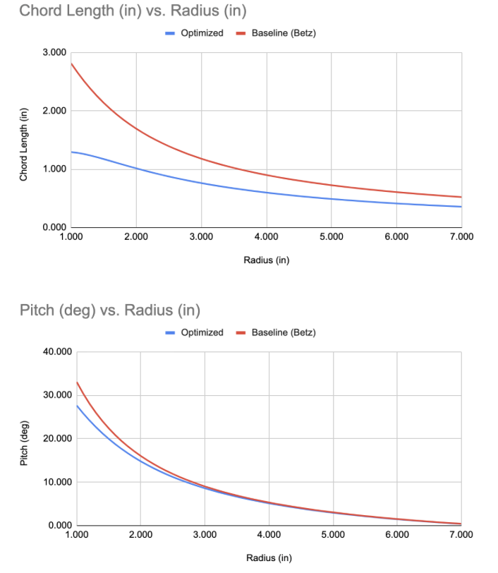
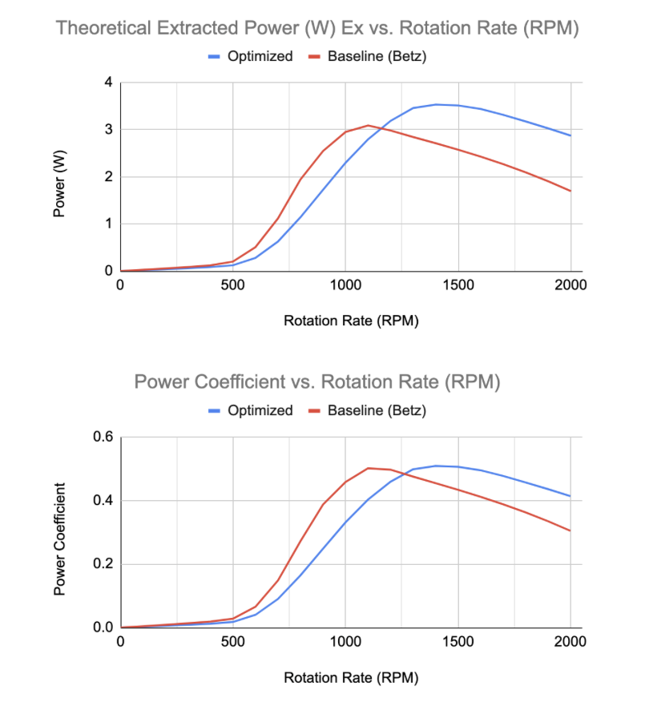
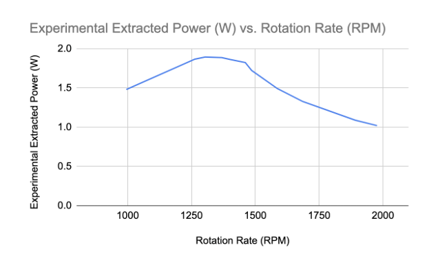

[← Back to Main Portfolio](../README.md)

# 🌪 Wind Turbine Blade Optimization – Airfoil Design Project

**MAE 4272 | Blade Element Momentum Theory | MATLAB | 3D Printing | Wind Tunnel Testing**

This project involved designing, optimizing, fabricating, and testing a set of small-scale wind turbine blades. Using Blade Element Momentum Theory (BEMT), our team created blades tailored for a specific wind distribution and design RPM. The project merged aerodynamic theory, MATLAB-based simulation, and real-world testing to evaluate performance gains from an optimized airfoil geometry.

---

## 🧠 Project Objectives

- Improve power extraction of a wind turbine operating at a constant RPM
- Optimize chord and pitch distributions using BEMT with tip loss and wake effects
- Fabricate blades with 3D printing and test them in a controlled wind tunnel environment
- Compare theoretical performance against baseline Betz-limit geometry and experimental data

> 📌 Airfoil: **NACA 4412**  
> 📌 Wind speed modeled by **Weibull distribution**  
> 📌 Design RPM: **1463 RPM**  
> 📌 Tip speed ratio: **λ = 5.7**

---

## 🛠️ Design Process

- Selected **NACA 4412** due to its manufacturable geometry and favorable lift-to-drag (CL/CD) characteristics
- Used MATLAB to:
  - Derive chord and pitch distributions across the blade radius
  - Integrate tip-loss correction factors (Prandtl model)
  - Evaluate power curves across different wind speeds and RPMs
- Defined performance at **most probable wind velocity** using Weibull distribution (U = 4.78 m/s)

  

<em>Figure 1: Chord length and pitch angle distributions for the optimized geometry</em>

---

## 📈 Simulation & Optimization Results

Using a custom MATLAB BEMT script, we generated theoretical performance curves comparing the optimized design to the baseline Betz-limit blade:

- 📈 Max power coefficient improved by **1.5%**
- ⚡ Power at design RPM increased by **30.2%**
- 🔋 Total energy extraction increased by **13.7%**

  

<em>Figure 2: Theoretical power curves comparing baseline and optimized blade designs</em>

---

## 🧪 Experimental Testing

- Blades were 3D printed and mounted to a DC motor equipped with a torque brake
- Wind tunnel tests were performed at:
  - Design velocity: **4.78 m/s**
  - Additional velocities: 4.53 m/s and 5.03 m/s (limited by power outage)
- Power vs RPM curve was measured by sweeping torque and calculating power output

> ⚠️ A building power outage limited our ability to collect multiple runs

---

## 🧾 Results Summary

| Metric                        | Theoretical | Experimental | Difference |
|------------------------------|-------------|--------------|------------|
| Max Power Output             | 3.52 W      | 1.89 W       | −46.4%     |
| Power @ Design RPM           | 3.52 W      | 1.72 W       | −51.2%     |
| Max Power Coefficient (Cp)   | 0.50        | 0.27         | −46.0%     |

  

<em>Figure 3: Measured power curve at design wind speed</em>

---

## 🧠 Reflections & Recommendations

Despite the significant drop in performance between theoretical and experimental results, our **optimized blade still outperformed the original Betz-limit blade design** during testing — validating the effectiveness of our design improvements.

Several factors likely contributed to the lower-than-expected experimental performance:

- **Blade Tip Deflection**: The 3D printed blades were more flexible than anticipated. At high RPMs, we observed visible tip deflection which distorted the intended aerodynamic shape, reducing lift and increasing drag — particularly at the blade tips where power contribution is highest.
  
- **Friction and Inertia in the Test Rig**: The turbine hub, motor shaft, and torque brake introduced some additional resistance not accounted for in the theoretical model. This parasitic drag decreased the net power output measured during testing.

- **Testing Interruptions**: Due to the power outage during our lab session, we were only able to complete a single velocity sweep, limiting our ability to tune, iterate, or verify results through repeated trials.

- **Assumptions in the model**: While our MATLAB simulation accounted for tip losses and wake effects, it still assumes ideal flow, no turbulence, and a perfectly rigid blade. Real-world flow separation, surface roughness, and slight alignment errors all degrade actual performance.

Despite these challenges, our optimized blade **extracted more power than the original blade in the same test conditions**, showing a clear improvement in aerodynamic efficiency. This confirms that even with real-world limitations, thoughtful design and modeling can lead to tangible performance gains.

### 📈 Key Takeaway:
**Theory guided our design**, but ** the experiments validated it**. Future iterations that address material stiffness, wind tunnel accuracy, and model assumptions can help close the gap between prediction and performance.

