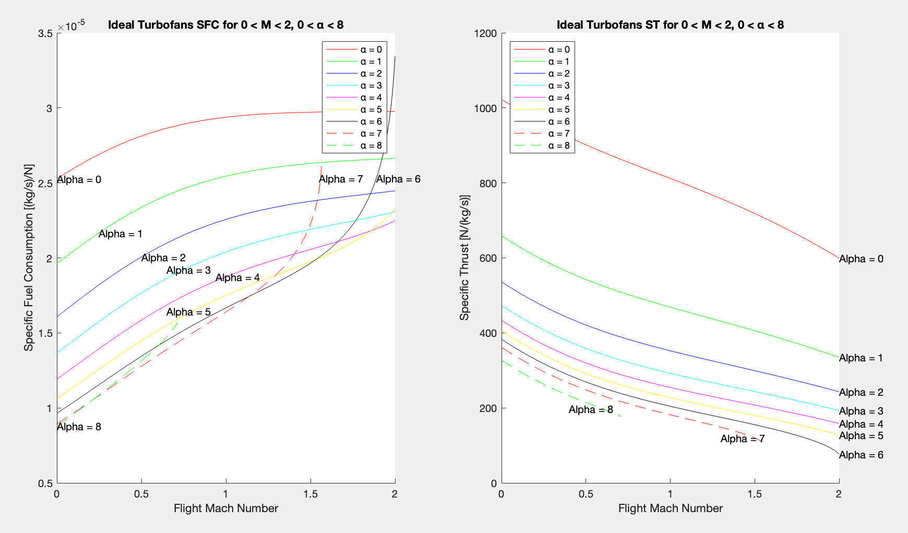
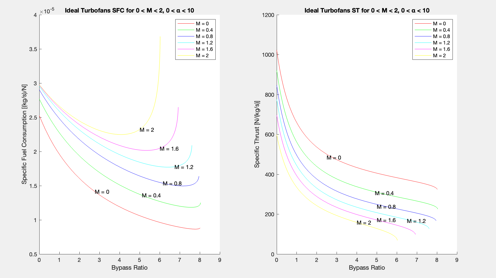

[← Back to Main Portfolio](../README.md)

# ✈️ Turbofan Performance Analysis – MATLAB Simulation Project

**MAE Thermodynamics | MATLAB Modeling | Jet Propulsion | Thermodynamic Cycle Analysis**

In this project, I built a MATLAB-based simulation of an **ideal turbofan jet engine** with separate exhausts for core and bypass flow. The goal was to study how two critical design variables — **bypass ratio (α)** and **flight Mach number (M₀)** — affect engine performance, focusing on two key metrics: **Specific Fuel Consumption (SFC)** and **Specific Thrust (ST)**.

---

## 🧠 Objectives

- Model an ideal turbofan using isentropic relations and energy balance
- Analyze the impact of bypass ratio and Mach number on SFC and ST
- Visualize trade-offs between efficiency and thrust across flight conditions
- Verify model accuracy against known benchmark values

> 🔍 Validated against:  
> α = 4, M₀ = 0.9 → SFC ≈ 1.83E-5 kg/N·s, ST ≈ 265 N/(kg/s), Tt5 ≈ 963 K

---

## ⚙️ Model Parameters

| Parameter                  | Value                 |
|---------------------------|-----------------------|
| Total temperature (T₀)    | 217 K                 |
| Total pressure (P₀)       | 26,500 Pa             |
| Turbine Tt₄               | 1500 K                |
| Compressor Pressure Ratio | 10                    |
| Fan Pressure Ratio        | 2.5                   |
| Gamma (γ)                 | 1.4                   |
| Gas constant (R)          | 287 J/kg·K            |
| Bypass Ratios (α)         | 0 to 8                |
| Mach Numbers (M₀)         | 0 to 2                |

All calculations assumed ideal, steady, isentropic flow and neglected mechanical losses.

---

## 📊 Simulation Outputs

Two key plots were generated from the MATLAB simulation:

### 1. SFC and ST vs. **Mach Number** (0 ≤ M₀ ≤ 2)

  

<em>Figure 1: Specific Fuel Consumption and Specific Thrust vs. Mach Number at varying bypass ratios</em>

---

### 2. SFC and ST vs. **Bypass Ratio** (0 ≤ α ≤ 8)

  

<em>Figure 2: Specific Fuel Consumption and Specific Thrust vs. Bypass Ratio across Mach Numbers</em>

---

## ✅ Benchmark Verification

To verify accuracy, I used the following test case:  
**α = 4**, **M₀ = 0.9**

| Metric                        | Calculated Value | Expected Value | Error   |
|------------------------------|------------------|----------------|---------|
| Specific Fuel Consumption    | 1.83e-5 kg/N·s   | 1.83e-5 kg/N·s | ✓       |
| Specific Thrust              | 265 N/(kg/s)     | 265 N/(kg/s)   | ✓       |
| Tt₅                          | 963 K            | 963 K          | ✓       |
| Core Exit Velocity (V₉)      | 770 m/s          | 770 m/s        | ✓       |
| Bypass Exit Velocity (V₁₉)   | 471 m/s          | 471 m/s        | ✓       |

---

## 🧠 Reflections & Recommendations

This project highlighted the power of simulation in understanding the fundamental trade-offs in turbofan engine design. By analyzing how **bypass ratio (α)** and **flight Mach number (M₀)** affect **specific thrust (ST)** and **specific fuel consumption (SFC)**, we were able to visualize performance landscapes that align with real-world engine architectures.

### Key Observations:

- **Bypass Ratio Trade-offs**: As expected, increasing bypass ratio significantly improved fuel efficiency (lower SFC) but at the cost of lower specific thrust. This confirms why high-bypass turbofans are preferred for subsonic commercial aircraft, where fuel efficiency outweighs raw thrust requirements.

- **Mach Number Sensitivity**: At low Mach numbers, engines with higher bypass ratios performed exceptionally well in terms of SFC. However, at higher Mach numbers, the SFC penalty for high-bypass designs became more pronounced due to velocity mismatch and increasing drag effects.

- **Design Optimization Sweet Spot**: The analysis showed that there is a diminishing return in performance gains after a certain bypass ratio. For instance, the improvement in SFC from α = 6 to α = 8 was marginal compared to the dramatic drop in ST. This insight supports practical design choices where engine size and nacelle drag become limiting factors.

- **Validation Checkpoint**: Our calculated values at α = 4 and M₀ = 0.9 matched the provided benchmarks (e.g., SFC ≈ 1.83E-5 kg/N·s and ST ≈ 265 N/kg/s), confirming that the model and `thermoAnalysis` function were implemented correctly.

### Model Limitations & Future Work:

- **Ideal Flow Assumptions**: Our model assumed ideal, isentropic flow and perfect mechanical efficiency. Real turbofans experience losses due to turbulence, blade tip clearance, mixing inefficiencies, and component degradation.

- **Single Operating Point**: The analysis assumes steady cruise conditions. In practice, engine design must consider transient behavior (takeoff, climb, descent), which would require multi-point analysis or integration with engine cycle software like NPSS or GasTurb.

- **Separate Nozzle Expansion**: While our model accounted for separate exhausts for core and bypass, it assumes optimal expansion to ambient pressure. In reality, nozzle design affects flow separation, shock formation, and thrust efficiency.

- **No Weight or Cost Consideration**: Increasing bypass ratio increases engine diameter, and weight. However, none of these conditions were captured in the analysis but are important in real-world aircraft performance and design trade studies.

[← Back to Main Portfolio](../README.md)
