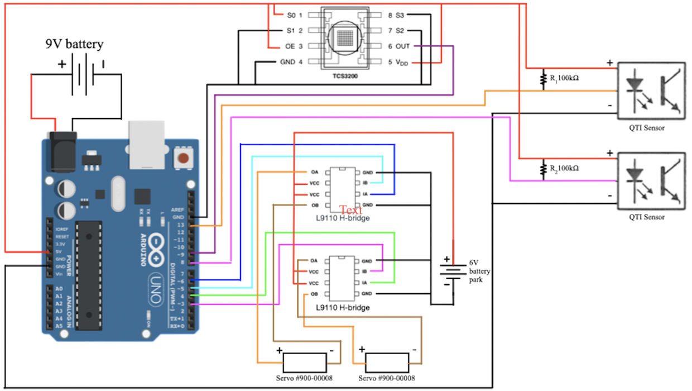

[← Back to Main Portfolio](../README.md)

# 🤖 Autonomous Robot – Cube Craze Competition

**Embedded Systems | Arduino Uno | Autonomous Navigation | Sensors + Actuation**

This project was part of a competitive embedded systems challenge at Cornell University. Our team, **Free Bird**, designed, built, and programmed a fully autonomous Arduino-powered robot to navigate a game board, identify color zones, collect wooden blocks, and return to its origin.

---

## ⚙️ Overview

The robot was constructed on a lightweight chassis with two driven wheels and a front-mounted collection scoop made from a repurposed license plate. An Arduino Uno processed sensor inputs and controlled motion through dual H-bridge motor drivers.

Key behaviors:
- Identify starting zone via color sensing
- Navigate diagonally to the block region
- Detect board boundaries using QTI sensors
- Collect blocks with a physical scoop
- Return to the starting zone autonomously
  

  

  <em>Figure 1: Top view of the robot showing Arduino, breadboard, and aluminum scoop</em>

---

## 🔌 Electrical System

The electrical system integrated multiple sensors and two motors:

- **Sensors**
  - TCS3200 Color Sensor (detects start zone color)
  - Two QTI Edge Detectors (detect board boundaries)
- **Actuation**
  - Two DC motors driven via L9110 H-Bridge ICs
- **Power**
  - 9V battery for the Arduino
  - 6V battery pack for motors

  

  <em>Figure 2: Full schematic circuit diagram </em>

---

## 🧠 Software Logic & Strategy

Our robot was programmed using custom Arduino C code that implemented the following logic:

1. **Initialization**
   - Detect starting color (yellow or blue)
   - Set that color as "home zone"

2. **Navigation Sequence**
   - Move diagonally toward the block region
   - Use QTI sensors to detect boundary lines (black)
   - Upon detecting the secondary zone, turn and approach cubes

3. **Block Collection**
   - Push into the cube pile with the scoop
   - Reverse and return along original path
   - Drop off cubes and repeat

4. **Return to Home Zone**
   - Use the same sensor logic to recognize the home color and stop

The robot used condition-based logic to update movement decisions in real-time.

---

## 🏁 Competition Results

- **Wins:** Finished 4 wins, 2 losses
- **Challenges:**
  - The one main challenge we faced was the interaction with the opponents robot. If the two bots collided, both got knocked off course. This was the cause of our two losses.
- **Fixes & Adjustments:**
  - Recalibrated the robot's starting orientation to better align with the field.
  - Repaired sensor wiring and improved response to edge detection events.
  - Include a forward facing sensor to allow our bot to avoid the competitors robot.
- **Insights:**
  - Our robot was faster than opponents to the larger wheels we 3d-printed.
  - Our robot was resilient to interruptions, but recovery from collissions remained a weakness.

---

## 💡 Reflections & Takeaways

- We learned how to **prioritize milestone goals** before tackling complex behaviors.
- The importance of **robust sensor mounting and wiring** was clear because minor issues caused major failures.
- **Testing under realistic conditions** (with distractions and bumps) would have improved reliability.
- **Advice to future teams:**
  - Start simple and get the base logic working reliably.
  - Don't overbuild before your robot can drive straight and respond to inputs correctly.

