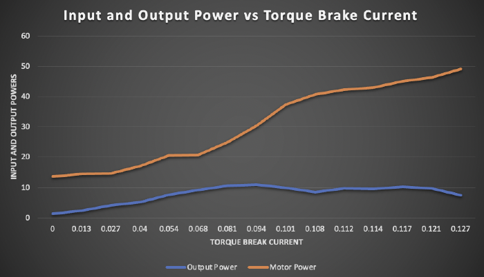
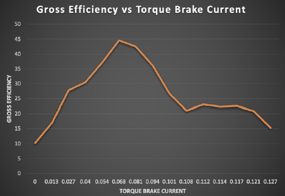

[← Back to Main Portfolio](../README.md)

# 🏗 Forklift and Torque Converter Lab

This project investigates the efficiency and drive systems of both **internal combustion engine (ICE)** forklifts and **electric motor-driven forklifts** through hands-on lab experiments. The goal was to measure power flow, identify losses, and analyze the differences between ICE and electric drive systems.

---

## 🔍 Project Motivation

We looked at an electric drivetrain as well as an ICE drivetrain to explore how forklifts are powered and how energy is transferred through mechanical systems. With over 75% of forklifts now electric, understanding the trade-offs between ICE and electric drive systems is essential for designing efficient, modern industrial vehicles.

---

## 🔧 Internal Combustion Forklift Studio

### 🔢 Measurements Taken using Chassis Dynamometer:
- Wheel RPM, static torque, output power
- PAU force
- Fuel mass over time (load cell)

### 🧮 Efficiency Analysis:
Gross efficiency was calculated using:
- **Output Power:** Derived from torque and wheel RPM  
- **Input Power:** Derived from fuel flow rate × lower heating value

### ⚙️ Sources of Loss:
- Engine heat loss and friction
- Transmission loss via torque converter
- Exhaust losses

---

## ⚡️ Electric Motor & Torque Converter Setup

### 🔢 Measurements:
- Motor input power (V, A, W)
- Output shaft torque and RPM
- Torque brake response and power output

### 🧠 Key Takeaways:
- Efficiency ranged from **10% to 45%**, averaging **26.5%**
- Most efficient state occurred at **20.6 W input**, ~45% efficiency
- Losses stemmed from the motor, torque converter, brake, and mechanical inefficiencies

  

  

<em>Figure 1: Input and Output Power vs Torque Break Current </em>

  

<em>Figure 1: Torque vs Effciency </em>

---
## 📈 Motor Characterization

By plotting **torque vs DC current** and performing linear regression, we obtained the following results:

- **Motor constant (k):** 0.7094 Nm/A  
- **Linear fit equation:** Torque = 0.7094 × Current − 0.5017  
- **Predicted torque at 0 A:** −0.5017 Nm  
- **No-load current:** ~0.707 A

Although the regression line does not pass through the origin, it crosses the **x-axis at approximately 0.707 A**. This value represents the **no-load current**, or the minimum current required to overcome internal losses such as bearing friction, windage, and core drag before generating positive output torque. 

In this context, the **negative torque intercept (−0.5017 Nm)** reflects the regression fit's extrapolation, rather than a physically meaningful torque value at zero current.

  

<em>Figure: Linear regression of torque vs current to determine motor constant and no-load characteristics</em>

---

## 🔋 Electric Forklift vs. ICE Forklift

### 🔄 Drive System Comparison:

| Feature                  | ICE Forklift                     | Electric Forklift                           |
|--------------------------|----------------------------------|----------------------------------------------|
| Power Source             | Gasoline / Diesel                | Battery-powered electric motors              |
| Transmission             | Torque converter, multi-speed    | Direct drive, planetary gear reduction       |
| Torque Delivery          | Delayed, needs revs              | Instant torque from 0 RPM                    |
| Maintenance              | High (many moving parts)         | Low (simpler system)                         |
| Efficiency               | ~8%                              | 26.5% average (up to 45%)                    |
| Environment Suitability  | Better for outdoor, long hours   | Best for indoor, low-emission environments   |

---

## 🧪 Conclusion

### ✅ Use Electric Forklifts when:
- Operating **indoors**
- **Exhaust and noise** are a concern
- You want **lower long-term operating costs**

### ✅ Use ICE Forklifts when:
- Operating **outdoors**
- You need **long runtime** with fast refueling
- You're on a **tight budget** or dealing with **extreme temperatures**

---

## 📌 Final Thoughts

This lab emphasized the **importance of drivetrain architecture** in vehicle design. While ICE forklifts remain valuable in high-demand scenarios, electric forklifts offer clear benefits in efficiency, simplicity, and sustainability.

[← Back to Main Portfolio](../README.md)
