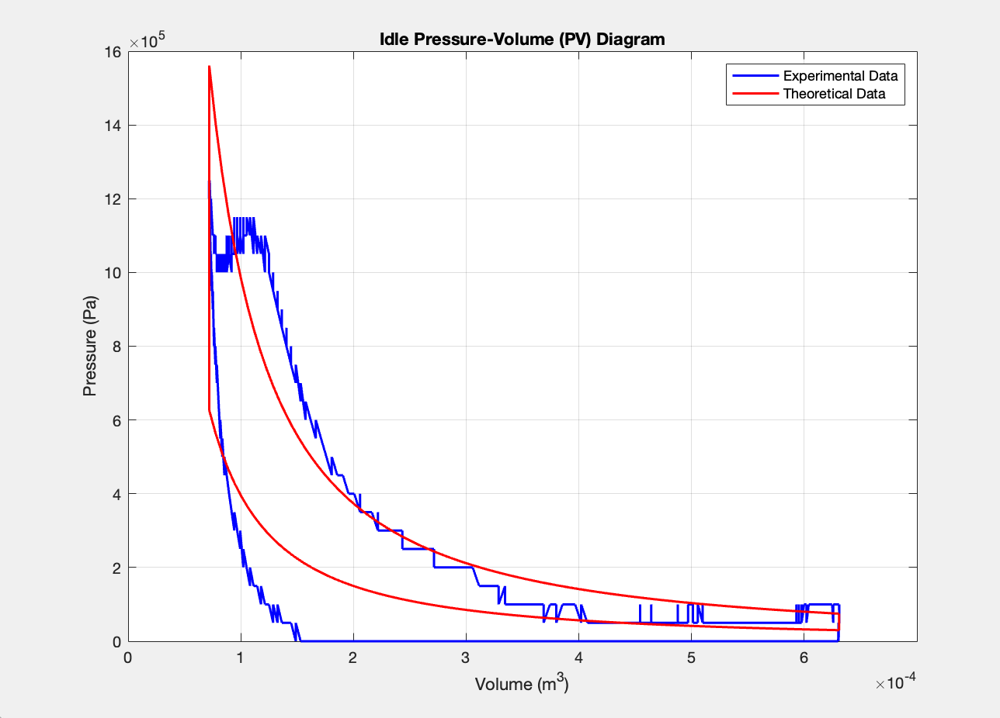

[← Back to Main Portfolio](../README.md)

# 🔥 Forklift Engine PV Diagram – Experimental & Theoretical Modeling

**MAE Internal Combustion Engines | MATLAB | Data Acquisition | Otto Cycle Approximation**

This project involved developing a MATLAB simulation and data-processing workflow to produce a **Pressure-Volume (PV) diagram** for a small-displacement forklift engine. Using experimental pressure data, crank angle conversion, and known engine geometry, we reconstructed the full engine cycle and compared it to an idealized Otto cycle.

---

## 🧠 Project Objectives

- Process real-time pressure data from a test forklift engine
- Convert time-domain data into crank angle and volume
- Model and visualize an experimental PV diagram
- Overlay theoretical Otto cycle on top of experimental results for comparison

> 🛠️ Engine Type: 0.658 L forklift engine  
> 🧪 Measured at Idle RPM ≈ 750  
> ⚙️ Experimental data captured via pressure sensor and mass flow instrumentation

---

## ⚙️ Data & Model Parameters

| Parameter              | Value                |
|------------------------|----------------------|
| Engine Stroke (s)      | 86 mm                |
| Bore (b)               | 91 mm                |
| Connecting Rod (L)     | 136.4 mm             |
| Compression Ratio (r)  | 8.8                  |
| Idle RPM               | 750.96               |
| Ambient Pressure (P₁)  | 30,000 Pa            |
| Peak Combustion Pressure (P₃) | 1.56 MPa       |

We used time-based pressure measurements and converted them to angular crank position using RPM and time differentials. Volumes were calculated using geometric relations for reciprocating piston motion.

---

## 📊 MATLAB Outputs

### 1. Experimental and Theoretical P–V Diagram, Otto Cycle 

The experimental pressure data was collected over time at idle RPM, then converted to crank angle using RPM and time differentials. Instantaneous cylinder volume was calculated using a crank-slider geometric model, allowing us to reconstruct the full cycle and ultimately convert pressure vs time into pressure vs volume.

A theoretical Otto cycle was plotted using known pressure-volume states (P₁–P₄, V₁–V₄) and isentropic relations (k = 1.4). This curve was overlaid on the experimental result to illustrate theoretical vs experimental behavior.

  

<em>Figure 1: Overlay of experimental and theoretical PV curves for comparison</em>

---

## 📈 Key Observations

- The shape of the experimental PV curve successfully captured the **intake, compression, power, and exhaust strokes**, with some expected deviations from the ideal Otto cycle.
- The **compression and expansion processes** were notably non-isentropic due to real-world effects like heat loss and friction.
- **Peak pressure timing** aligned reasonably well with top dead center (TDC), indicating proper data calibration and conversion.
- Sensor lag and non ideal combustion likely contributed to the rounding of parts of the graph compared to the sharp transitions in the theoretical model.

---

### Possible Reasons for Experimental-Theoretical Mismatch:

- **Sensor Error & Delay**: The pressure transducer likely experienced a small time lag, smoothing the sharp pressure rise expected during combustion.
- **Heat Transfer Losses**: Unlike the adiabatic assumption in the Otto model, real cylinders lose significant heat to the walls, reducing pressure rise and causing deviations in the expansion stroke.
- **Friction and Valve Timing**: Losses due to mechanical friction and intake/exhaust valve delay reduce net cylinder pressure during key points of the cycle.

## 🧠 Reflections & Recommendations

This project emphasized the value of combining real engine data with theoretical modeling to better understand engine behavior and performance losses.

[← Back to Main Portfolio](../README.md)
