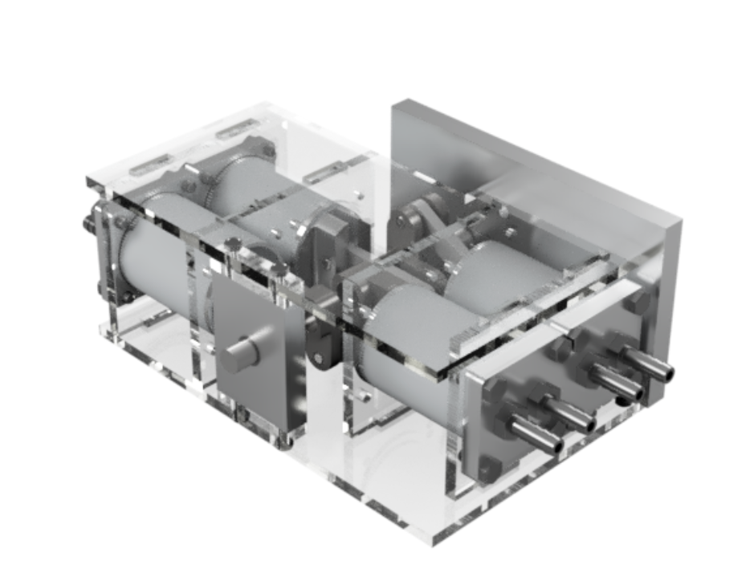
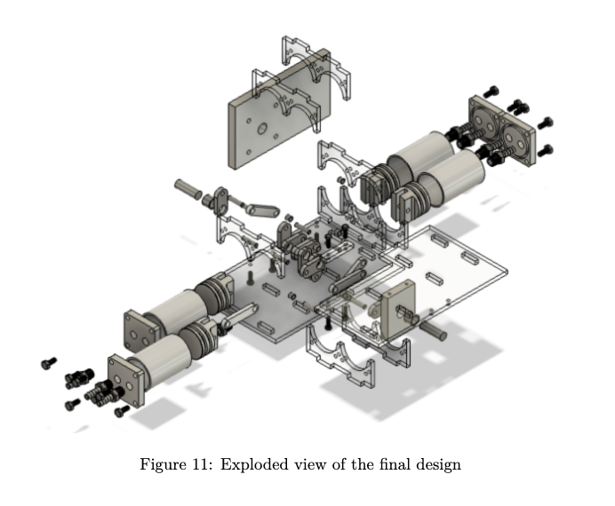
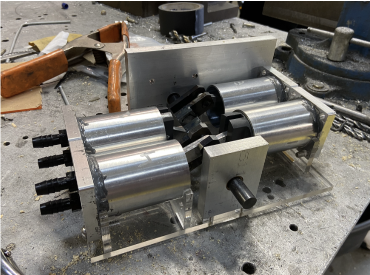
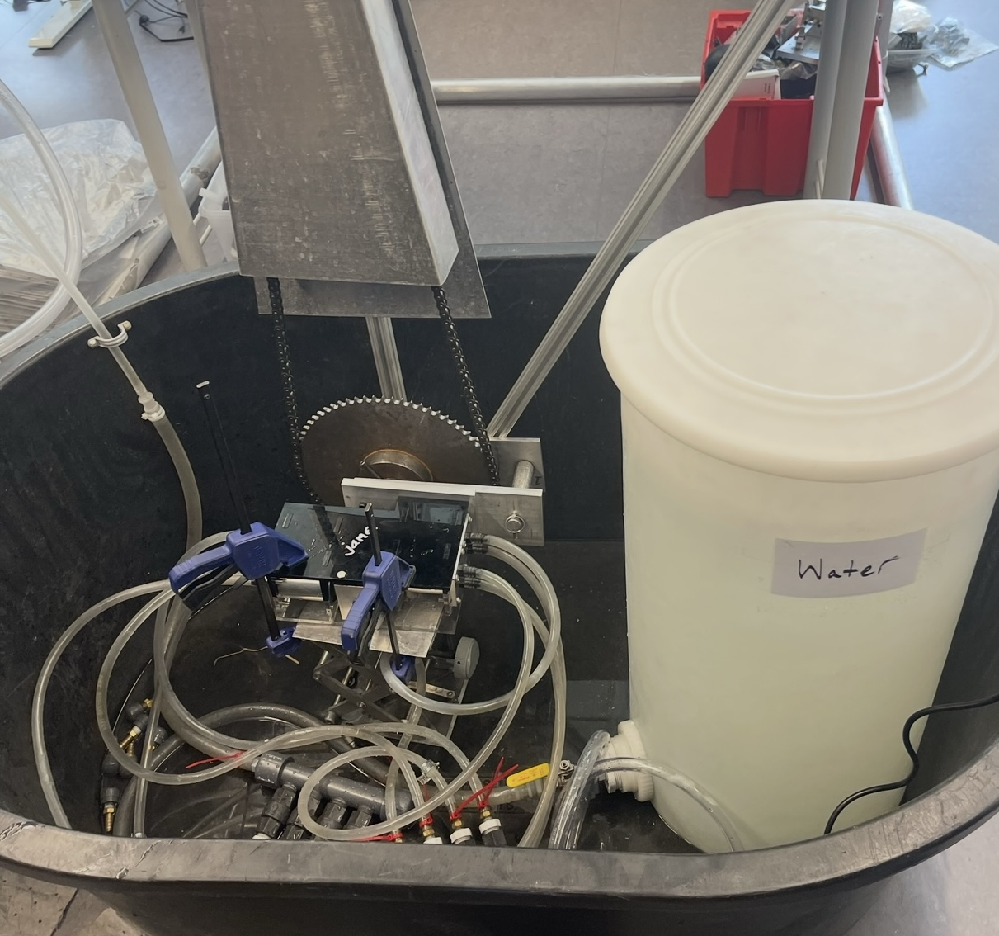
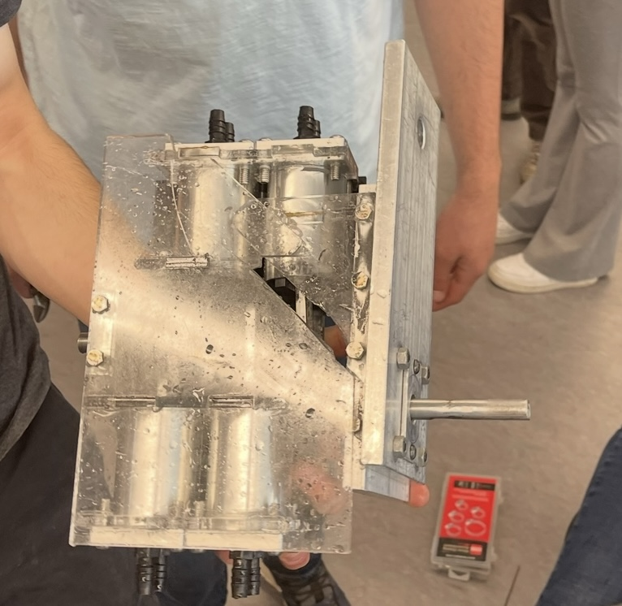

[← Back to Main Portfolio](../README.md)

# 💧 Water Pump Design & Fabrication – Multistage Mechanical Engineering Project

**MAE| Design for Manufacturing | Precision Machining | Fluid Systems**

This team project involved the full-cycle development of a **multi-cylinder piston water pump**, including design, simulation, budgeting, fabrication, and performance testing. The final product was a 4-cylinder reciprocating pump driven by a custom-fabricated steel crankshaft, designed to exceed 1 L/min of flow.

---

## Project Objectives

- Design a **compact, mechanically efficient** piston-style water pump
- Simulate expected volumetric flow rates and optimize cylinder configuration
- Fabricate the entire assembly using lathes, mills, and manual machining tools
- Test flow performance at different motor speeds to verify volumetric efficiency

> 💡 Target flow rate: 1.0 L/min at half speed  
> ✅ Achieved: 15.7 L/min at 60 RPM  
> 🔩 Team-machined components: crankshaft, pistons, cylinders, mounting plates

---

## Final CAD Design

After several iterations, the team finalized a 4-cylinder layout in opposing pairs, with staggered crankshaft eccentrics, U-shaped acrylic supports, aluminum constraint plates, and NPT hose fittings for water flow.

  

<em>Figure 1: Final CAD assembly showing pistons, crankshaft, mounting plates, and U-supports</em>

  

<em>Figure 2: Exploded view waterpump CAD, and U-supports</em>

---

## Fabrication & Manufacturing Strategy

The project required detailed tolerance planning and multi-process machining, including:

- **Lathe:** Pistons, cylinders, dowel pins, crankshaft shaft stock
- **Milling:** Mounting plates, constraint plates, crankshaft eccentrics
- **Welding:** Steel crankshaft components and eccentric pin assemblies
- **Laser Cutting:** Laser-cut U-supports and puzzle-fit acrylic base and top plates

Parts were machined in parallel by team members and assembled after verifying tolerances.

> 💸 Total cost: $75 (under budget)  
> 🗓️ Full fabrication timeline: 2 weeks

  

<em>Figure 3: Pump Assembly with top acrylic plate not attached</em>

---

## Testing & Results

The pump was connected to a test motor and run at both half (60 RPM) and full (120 RPM) speed using hose fittings and a faceplate mount. Volumetric flow was measured by observing water displacement in a container.

### Half-Speed Performance:
- Output flow rate: **15.7 L/min**
- Expected volumetric efficiency: **≈ 80%**
- Observed minor leakage due to worn piston seals from dry testing

### Full-Speed Outcome:
- Acrylic base and top plates **snapped** after a few seconds.
- We expect this is due to an error of not opening the valve and allowing water to enter the pump before spinning the crankshaft at full speed
- Once we opened the valve we believe the high pressure difference likely caused the brittle acrylic plates to fracture due to the sudden load
- Despite the failure, the pump **met all performance goals even atlow speed** and exceeded design expectations
- Professor stated that our pump was the most successful pump he's seen in the last ten years of running the project.

  

<em>Figure 4: Water pump connected to motor for volumetric flow rate testing</em>

  

<em>Figure 5: Aftermath from critical fracture </em>

---

## Reflections & Recommendations

This project demonstrated the challenges and rewards of a full mechanical system development.

### What Worked:
- Met flow rate targets by **over 15×** at half speed
- Tolerancing of pistons and cylinders produced a strong seal and reliable motion
- Acrylic puzzle-fit support system added rigidity and reduced vibration

### What Could Be Improved:
- **Acrylic structural parts** were the weak link; upgrading to aluminum would allow high-speed operation
- Press fits and tight tolerances could have been refined with a higher budget and more time
- Future versions could account more for **vibration damping** despite our pump already doing a good job in this category

### Key Takeaways:
- Planning for failure like adding two support acrylics instead of one, made troubleshooting faster and more effective
- The self-performed manual machining experience taught how **design decisions impact manufacturability**
- Collaboration and parallel work allowed us to his the tight deadlines while succeeding

[← Back to Main Portfolio](../README.md)
